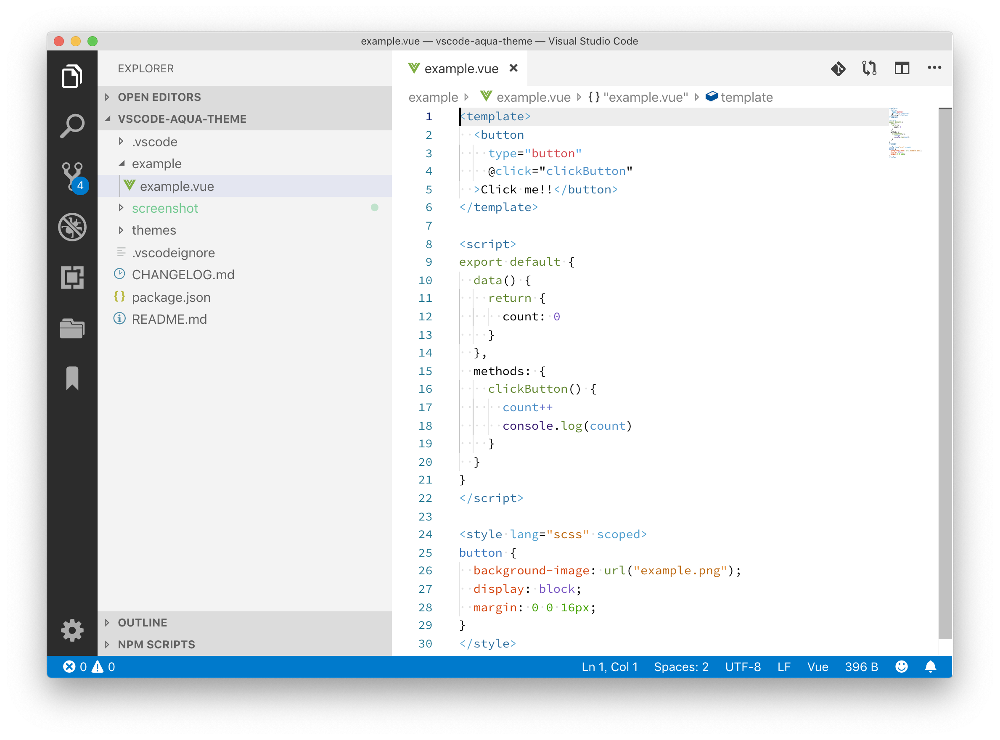
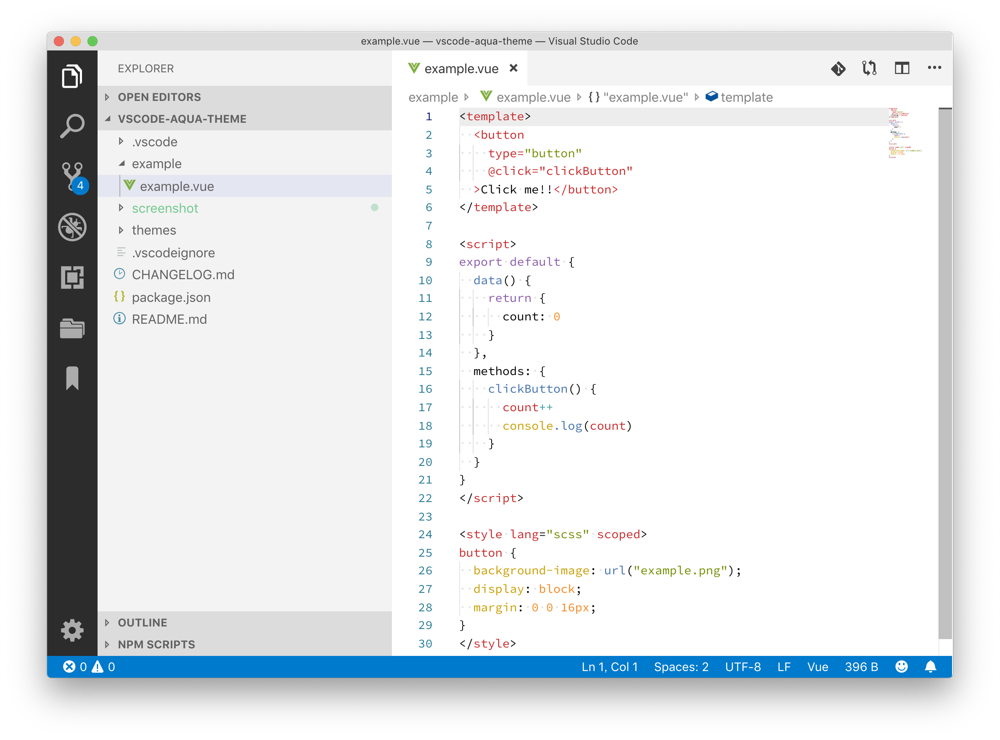
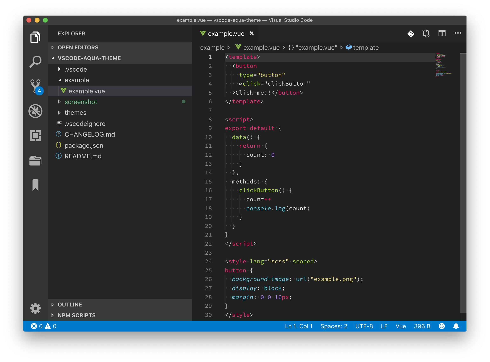
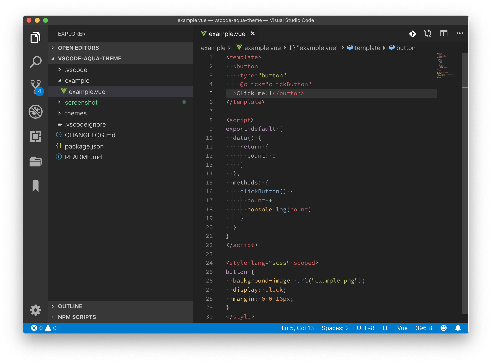

# Aqua Theme

[Aqua Theme - Visual Studio Marketplace](https://marketplace.visualstudio.com/items?itemName=kimulaco.vscode-aqua-theme)

Color theme converted from [Aqua Theme](https://github.com/cafarm/aqua-theme) for Visual Studio Code.

- Light Theme
    - Espresso Aqua
    - Tomorrow Aqua
- Dark Theme
    - Monokai Aqua
    - Tomorrow Night Aqua

## Screenshot

### Espresso Aqua

### Tomorrow Aqua

### Monokai Aqua

### Tomorrow Night Aqua

## Installation

1. Install "Aqua Theme" from Extensions menu.
2. Select the desired theme name from "Color Theme" in the command palette.

## Contributing

Please create an [Issue](https://github.com/kimulaco/vscode-aqua-theme/issues) or [Pull requests](https://github.com/kimulaco/vscode-aqua-theme/pulls) if you have any improvements!

### Development

Refer to ["Color Theme | Visual Studio Code Extension API"](https://code.visualstudio.com/api/extension-guides/color-theme) and develop while previewing the color theme.

## License

It is a [Creative Commons Attribution-ShareAlike 3.0 License](https://creativecommons.org/licenses/by-sa/3.0/) according to the license of [Soda Theme](https://github.com/buymeasoda/soda-theme) which is the original of [Aqua Theme](https://github.com/cafarm/aqua-theme).
